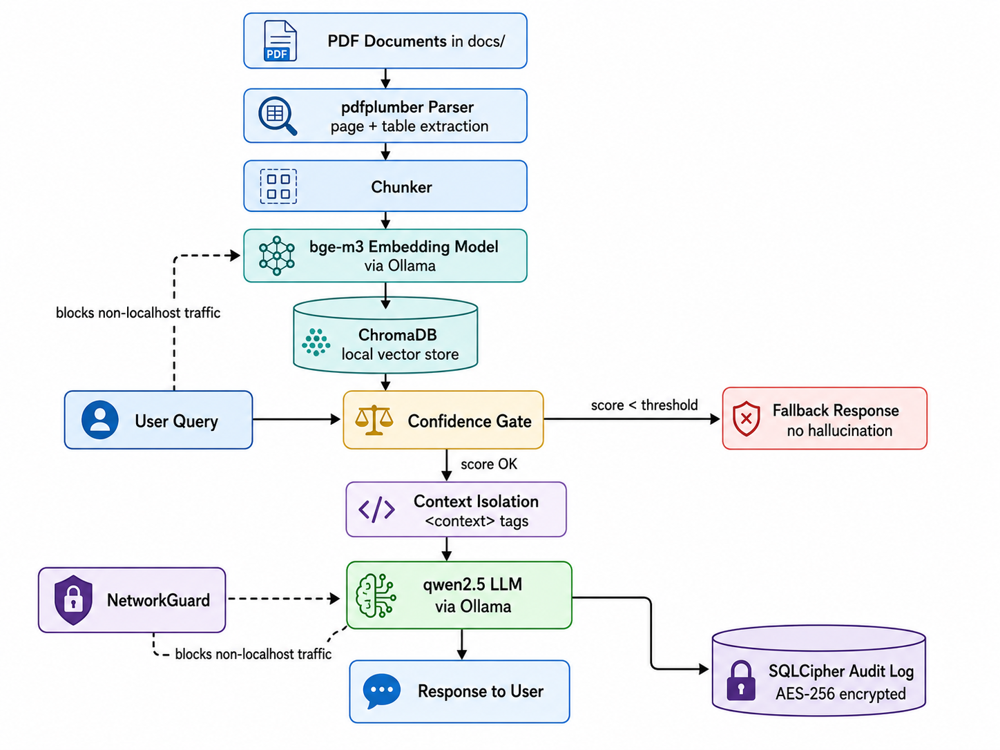

# Local PDF RAG Agent

Ollama ve Chroma kullanan, kendi PDF'lerinizle çalışan yerel bir RAG eğitim projesi. CLI referans arayüzdür; PySide6 masaüstü arayüzü ve SQLCipher audit kaydı isteğe bağlıdır.


## Hızlı başlangıç

Python 3.12 ve [Ollama](https://ollama.com/) kurulu olmalıdır. Ollama'yı başlatın ve varsayılan modelleri indirin:

```bash
ollama pull bge-m3
ollama pull qwen2.5:1.5b-instruct
```

macOS/Linux:

```bash
python3.12 -m venv .venv
source .venv/bin/activate
python -m pip install -e .
cp .env.example .env
python -m src.cli.main
```

Windows PowerShell:

```powershell
py -3.12 -m venv .venv
.venv\Scripts\Activate.ps1
python -m pip install -e .
Copy-Item .env.example .env
python -m src.cli.main
```

PDF dosyalarınızı `docs/` içine kopyalayın. Uygulama yeni dosyaları indeksler, değişen dosyaların chunk'larını değiştirir ve silinen dosyaları indeksten kaldırır. `:status`, `:export` ve `:quit` CLI komutlarıdır.

## Yapılandırma

`.env.example` dosyasını `.env` olarak kopyalayın; kod değişikliği gerekmez.

| Değişken | Varsayılan | Açıklama |
|---|---:|---|
| `OLLAMA_BASE_URL` | `http://localhost:11434` | Ollama API adresi |
| `CHAT_MODEL` | `qwen2.5:1.5b-instruct` | Yanıt modeli |
| `EMBED_MODEL` | `bge-m3` | Embedding modeli |
| `DOCS_DIR` / `DB_DIR` / `AUDIT_DIR` | `docs` / `db` / `audit` | Veri dizinleri |
| `RETRIEVAL_K` | `3` | Alınacak en yakın chunk sayısı |
| `CHUNK_SIZE` / `CHUNK_OVERLAP` | `500` / `50` | Chunk ayarları |
| `CONFIDENCE_THRESHOLD` | `0.45` | Minimum cosine benzerliği |
| `CONFIDENCE_HIGH_THRESHOLD` | `0.80` | GUI yüksek güven göstergesi |
| `AUDIT_ENABLED` | `false` | Şifreli sorgu kaydını etkinleştirir |
| `AUDIT_DB_KEY` | boş | Audit açıkken en az 16 karakter olmalı |

Embedding modelini değiştirirseniz mevcut `db/` indeksini kaldırıp PDF'leri yeniden indeksleyin. Uygulama uyumsuz indeksi sessizce kullanmaz.

## İsteğe bağlı özellikler

GUI:

```bash
python -m pip install -e '.[gui]'
python -m src.ui.main_window
```

Şifreli audit:

```bash
python -m pip install -e '.[audit]'
```

Ardından `.env` içinde `AUDIT_ENABLED=true` ve güçlü, benzersiz bir `AUDIT_DB_KEY` ayarlayın. Audit export'ları soru ve yanıt içerebilir; hassas dosya olarak saklayın. CSV/XLSX hücreleri formül enjeksiyonuna karşı etkisizleştirilir.

## Docker ile CLI

Ollama host üzerinde çalışırken:

```bash
docker compose run --rm rag-cli
```

Compose `docs`, `db` ve `audit` dizinlerini kalıcı bağlar. Docker GUI çalıştırma yolu değildir. Linux'ta host Ollama erişimi ortamınıza göre ek yapılandırma gerektirebilir.

## Testler

```bash
python -m pip install -e '.[test]'
python -m pytest
```

Normal test paketi Ollama indirmez. Gerçek servis testleri ayrıca `integration` marker'ı ile opt-in tutulur.

```bash
RUN_OLLAMA_INTEGRATION=1 python -m pytest tests/integration
```

## Güvenlik sınırları

- Yerel modeller ve yerel depolama, harici API kullanımını azaltır; tek başına mevzuat uyumluluğu veya veri sızıntısına karşı garanti sağlamaz.
- `NetworkGuard` uygulama içindeki socket bağlantıları için yardımcı bir savunmadır. İşletim sistemi firewall'u, container ağı, erişim kontrolü veya süreç izolasyonunun yerini tutmaz.
- Confidence gate düşük benzerlikli sonuçları reddeder ancak hatasız ya da "hallucination-free" yanıt garantisi vermez. Kaynakları doğrulayın.
- Gerçek kurum dokümanlarını, audit export'larını, `.env` dosyasını ve model ağırlıklarını Git'e eklemeyin.
- Audit anahtarı kaybolursa kayıtlar kurtarılamaz; açığa çıkarsa anahtarı döndürün ve yeni bir veritabanı oluşturun.

## Sorun giderme

- “Yerel dil modeli yanıt üretemedi”: `ollama serve` çalışıyor mu, `OLLAMA_BASE_URL` ve model adları doğru mu kontrol edin.
- “Embedding modeli farklı”: `db/` dizinini yedekleyip temizleyin ve yeniden başlatın.
- SQLCipher bulunamadı: `pip install -e '.[audit]'` kullanın veya audit'i kapalı bırakın.
- PDF indekslenmiyor: dosyanın okunabilir ve metin içeren bir PDF olduğunu doğrulayın; başarısız dosya sonraki açılışta yeniden denenir.

## Mimari



`src/loaders` PDF çıkarma, `src/indexing` registry/chunk/index yaşam döngüsü, `src/retrieval` confidence gate ve prompt bağlamı, `src/audit` opsiyonel şifreli kayıt, `src/cli` ve `src/ui` arayüzleri içerir.
