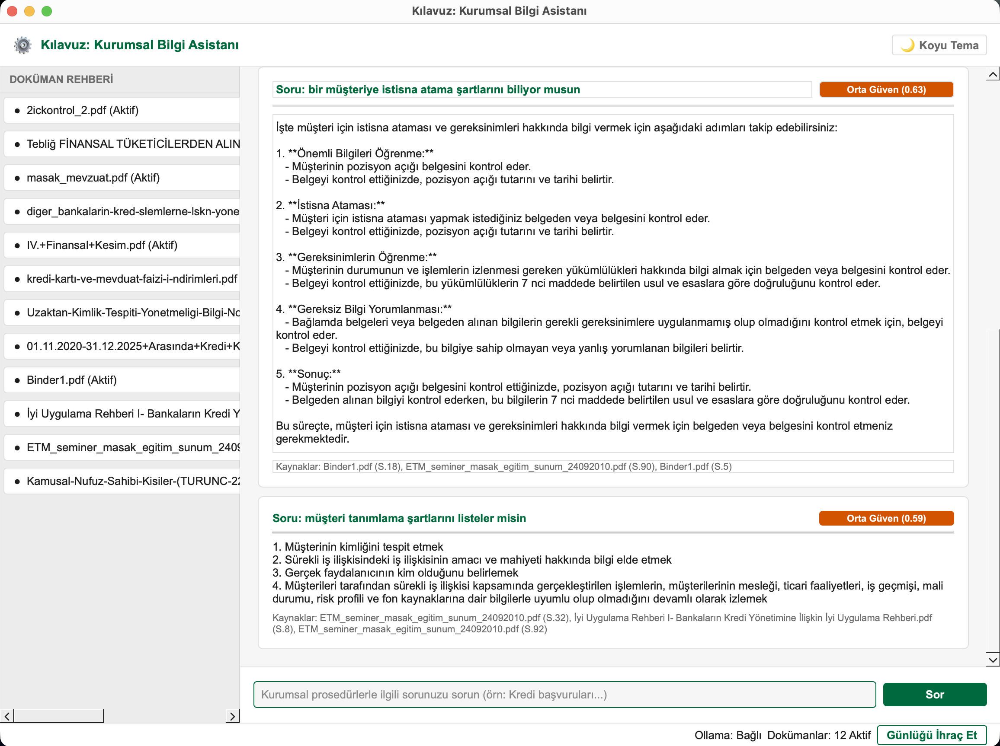

# Local Q&A Guideline Assistant (Local RAG Agent)

This project is a 100% local, offline, RAG (Retrieval-Augmented Generation) based desktop and console assistant designed to guide staff using internal Turkish PDF documents.

---

## Project Overview



This project features a **fully isolated and offline** infrastructure that guarantees no data or log records leave the system, in compliance with strict banking/financial sector compliance requirements (such as BDDK and MASAK in Turkey). 

Through a rich graphical user interface (PySide6) or an interactive command-line interface (CLI), users can perform semantic search across local documents, maintain secure audit logs, and ensure 100% data privacy with an offline network firewall (NetworkGuard).

---

## Technologies Used

- **Python 3.12**: The core programming language of the project.
- **PySide6 (Qt for Python)**: A rich, modern, dark/light theme supported desktop graphical user interface (GUI).
- **LangChain**: The framework used to manage the RAG pipeline and local models.
- **Local Ollama**: Serves the `qwen2.5:1.5b-instruct` LLM and `bge-m3` embedding model locally.
- **ChromaDB**: An offline vector database using cosine similarity.
- **SQLCipher 4 (AES-256)**: An SQLite extension to store encrypted audit logs on disk using AES-256.
- **NetworkGuard (Socket Interceptor)**: A security layer that intercepts and blocks outbound connection requests at the socket level, keeping the application entirely on `localhost`.

---

## How It Works

1. **Document Loading & Parsing**: PDF documents placed in the `docs/` folder are read via `pdfplumber`, tables are converted to Markdown tables, and the text is parsed page-by-page.
2. **Vectorization & Registration**: Documents are vectorized using the local `bge-m3` embedding model and indexed into the local Chroma database. Added, modified, or deleted documents are automatically tracked using `DocumentRegistry`.
3. **Confidence Gate**: Similarity scores are calculated for the closest results returned from the vector database. If the best score is below `CONFIDENCE_THRESHOLD`, the system stops search execution to avoid hallucinations and returns a fallback response.
4. **Secure Querying (Defense-in-Depth)**: To prevent prompt injection attacks, retrieved context data is isolated within `<context>` tags, and combined with strict system prompts before being sent to the local `Ollama` model to generate responses.
5. **Cryptographic Audit Logging**: All user queries and generated answers are saved to the encrypted `audit_log.db` database using SQLCipher.
6. **Network Access Restriction**: During application initialization, the socket library is monkeypatched to block any outbound connection requests outside of `localhost`.

---

## Project Goal

The primary goal of this project is to achieve the following in high-security and regulation-compliant environments:
- Eliminate dependence on external APIs (such as OpenAI).
- Guarantee 100% data privacy by preventing sensitive corporate documents from leaking to the internet.
- Provide a robust, secure, and hallucination-free local assistant to guide staff decision-making processes.

---

## Installation and Setup Steps

Follow the steps below to run the application on your local machine.

### Step 1: Prepare the Project and Virtual Environment
Open your terminal and navigate to the project directory (`/path/to/llmlcl`). Create and activate a Python virtual environment:
```bash
# Navigate to the project directory
cd /path/to/llmlcl

# Create virtual environment
python3 -m venv venv

# Activate virtual environment
source venv/bin/activate
```

### Step 2: Install Required Python Packages
```bash
# Upgrade pip and install dependencies
pip install --upgrade pip
pip install -r requirements.txt
```

### Step 3: Configure Environment Variables (.env)
Create a `.env` file in the project root and add the following configuration:
```bash
cat <<EOT > .env
AUDIT_DB_KEY=CHANGE_ME_generate_with_openssl_rand_hex_32
CHAT_MODEL=qwen2.5:1.5b-instruct
EMBED_MODEL=bge-m3
CONFIDENCE_THRESHOLD=0.45
CONFIDENCE_HIGH_THRESHOLD=0.80
EOT
```
*Note: `AUDIT_DB_KEY` is the secret key used to encrypt the audit log database with AES-256. For security reasons, it should not be left empty. To generate a secure key of your own, run `openssl rand -hex 32` in your terminal and paste the generated value here.*

### Step 4: Start Ollama and Download Models
1. **Start Ollama**: Open the Ollama application on your local machine (ensure the Ollama icon is visible in your menu bar).
2. **Download Required Models**:
   Run the following commands in your terminal to download the local models:
   ```bash
   # Download embedding model (bge-m3)
   ollama pull bge-m3

   # Download LLM model (qwen2.5:1.5b-instruct)
   ollama pull qwen2.5:1.5b-instruct
   ```

### Step 5: Add PDF Documents
Copy the PDF manuals or guidelines you want to index into the `docs/` folder.

### Step 6: Directory Security and Permissions (Security)
Restrict read/write permissions of database and log folders to ensure only the user running the application can access them:
```bash
# Restrict permissions for db and audit directories
chmod 700 db audit
```

---

## Running the Application

### A) Launching the Desktop Interface (GUI):
Run the following command to start the desktop interface supporting dark/light themes:
```bash
python3 src/ui/main_window.py
```
*The application automatically detects new PDFs upon startup, indexes them in the background, and enables the search query input once the system is ready.*

### B) Launching the Interactive Console (CLI):
To run queries and export logs through the terminal:
```bash
python3 src/cli/main.py
```
- Type your question directly and press `Enter` to search.
- Type `:export` to export audit logs to a CSV file.
- Type `:status` to see the registration status of index files.
- Type `:q` or `:quit` to exit.

---

## Running Unit Tests

To run all security, file parser, and audit logging unit tests:
```bash
python3 -m pytest
```

---

