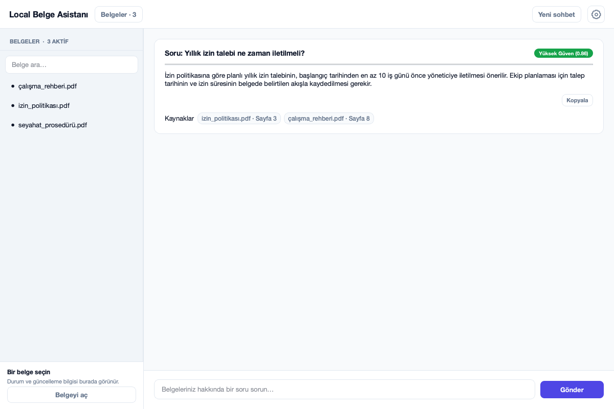

# Local RAG Agent

A local RAG (Retrieval-Augmented Generation) application for querying PDF documents on your machine using [Ollama](https://ollama.com/) and ChromaDB. Everything runs locally with no external API calls required.



## Features

- **CLI & Desktop GUI**: Full-featured terminal interface and a PySide6 desktop app with light/dark theme support.
- **Automatic Document Sync**: Drop PDFs into `docs/` — the app indexes new files, updates modified chunks, and cleans up deleted documents.
- **Direct PDF Citations**: Source buttons open your default PDF viewer directly to the cited page.
- **Quality & Confidence Filter**: Cosine similarity thresholding rejects irrelevant chunks before they reach the model.
- **Bilingual (EN / TR)**: Switch interface and response language on the fly (`:language en` / `:language tr` or via GUI settings).
- **Encrypted Audit Logging (Optional)**: SQLCipher-backed query and response logging with formula-injection-safe CSV/XLSX export.

---

## Quickstart

### Prerequisites

- Python 3.12 (`>=3.12,<3.14`)
- [Ollama](https://ollama.com/) installed and running

Pull the default models:

```bash
ollama pull bge-m3
ollama pull qwen2.5:1.5b-instruct
```

### Installation & CLI

1. **Clone and setup virtual environment:**

   ```bash
   # macOS / Linux
   python3.12 -m venv .venv
   source .venv/bin/activate
   pip install -e .
   cp .env.example .env

   # Windows (PowerShell)
   py -3.12 -m venv .venv
   .venv\Scripts\Activate.ps1
   pip install -e .
   Copy-Item .env.example .env
   ```

2. **Add PDFs and run:**
   
   Drop your PDF files into `docs/` and launch the CLI:
   
   ```bash
   python -m src.cli.main
   ```

   **CLI Commands:**
   - `:status` — Show index and system metrics
   - `:language en` / `:language tr` — Switch UI and response language
   - `:export` — Export audit logs (if audit is enabled)
   - `:quit` — Exit

---

## Desktop GUI

To use the PySide6 desktop interface, install the `gui` extra:

```bash
pip install -e '.[gui]'
python -m src.ui.main_window
```

---

## Configuration

Settings are configured via `.env` (copied from `.env.example`):

| Variable | Default | Description |
|---|---|---|
| `OLLAMA_BASE_URL` | `http://localhost:11434` | Ollama API endpoint |
| `CHAT_MODEL` | `qwen2.5:1.5b-instruct` | LLM used for answer generation |
| `EMBED_MODEL` | `bge-m3` | Embedding model for vector search |
| `DOCS_DIR` / `DB_DIR` / `AUDIT_DIR` | `docs` / `db` / `audit` | Data storage directories |
| `RETRIEVAL_K` | `3` | Number of chunks retrieved per query |
| `CHUNK_SIZE` / `CHUNK_OVERLAP` | `500` / `50` | Character size and overlap for text chunking |
| `CONFIDENCE_THRESHOLD` | `0.45` | Minimum cosine similarity required to pass context |
| `CONFIDENCE_HIGH_THRESHOLD` | `0.80` | High-confidence badge threshold in GUI |
| `AUDIT_ENABLED` | `false` | Enable SQLCipher encrypted query logs |
| `AUDIT_DB_KEY` | *(empty)* | Encryption key (min 16 chars when audit is enabled) |

> **Note:** If you change the embedding model, delete the `db/` folder and re-index your documents.

---

## Optional Modules

### Encrypted Audit Logging
```bash
pip install -e '.[audit]'
```
Set `AUDIT_ENABLED=true` and provide an `AUDIT_DB_KEY` (16+ characters) in `.env`. Exports to CSV/Excel sanitize cell formulas automatically.

### Docker (CLI)
```bash
docker compose run --rm rag-cli
```
Mounts `docs/`, `db/`, and `audit/` as persistent volumes while connecting to your host's Ollama instance.

---

## Testing

```bash
# Run unit tests
pip install -e '.[test,gui]'
pytest

# Run integration tests against real Ollama instance
RUN_OLLAMA_INTEGRATION=1 pytest tests/integration
```

---

## Project Structure

```
├── docs/           # Place your PDF documents here
├── src/
│   ├── loaders/    # PDF parsing & text extraction
│   ├── indexing/   # Chunking, document registry & ChromaDB indexing
│   ├── retrieval/  # Similarity search, confidence gating & prompt assembly
│   ├── audit/      # Optional SQLCipher logging & sanitized export
│   ├── cli/        # Terminal CLI interface
│   └── ui/         # PySide6 desktop GUI
├── tests/          # Unit and integration test suites
├── compose.yaml    # Docker Compose setup for CLI
└── pyproject.toml  # Project dependencies & build config
```
