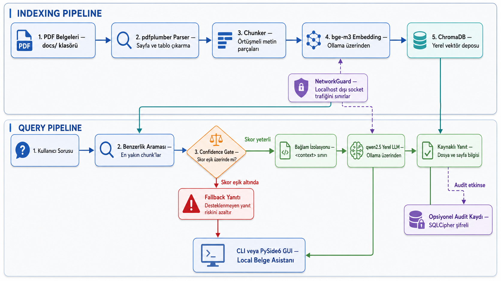

# Local Belge Asistanı

[English](README.md) | **Türkçe**

[Ollama](https://ollama.com/) ve ChromaDB altyapısıyla kendi PDF'leriniz üzerinde çalışan, gizlilik odaklı ve tamamen yerel bir RAG (Retrieval-Augmented Generation) uygulaması. CLI temel çalışma arayüzüdür; PySide6 masaüstü arayüzü ve SQLCipher şifreli audit kaydı isteğe bağlı bileşenler olarak sunulur.


Masaüstü arayüzünde aranabilir belge çekmecesi, belge ayrıntıları, doğrudan ilgili sayfaya yönlendiren kaynak düğmeleri, yanıt kopyalama, yeni sohbet başlatma ve kalıcı açık/koyu tema desteği bulunur. Ayarlar menüsünden sistem durumu izlenebilir ve audit etkinse loglar dışa aktarılabilir. Türkçe ve İngilizce arayüz ile yanıt desteği mevcuttur; varsayılan dil Türkçedir.

## Gereksinimler

- Python 3.12 (proje `>=3.12,<3.14` aralığını destekler)
- Yerel olarak çalışan [Ollama](https://ollama.com/) servisi
- Varsayılan embedding modeli: `bge-m3`
- Varsayılan sohbet modeli: `qwen2.5:1.5b-instruct`

```bash
ollama pull bge-m3
ollama pull qwen2.5:1.5b-instruct
```

## CLI Kurulumu

macOS / Linux:

```bash
python3.12 -m venv .venv
source .venv/bin/activate
python -m pip install -e .
cp .env.example .env
python -m src.cli.main
```

Windows PowerShell:

```powershell
py -3.12 -m venv .venv
.venv\Scripts\Activate.ps1
python -m pip install -e .
Copy-Item .env.example .env
python -m src.cli.main
```

PDF dosyalarınızı `docs/` dizinine kopyalayın. Uygulama yeni dosyaları otomatik olarak indeksler, değişen dosyaların eski chunk'larını yenileriyle günceller ve silinen dosyaları indeksten kaldırır. 

Kullanılabilir CLI komutları:
- `:status` - İndeks ve sistem durumunu gösterir
- `:export` - Audit kayıtlarını dışa aktarır (audit açıksa)
- `:language en` / `:language tr` - Arayüz ve yanıt dilini anında değiştirir (tercih kalıcıdır)
- `:quit` - Çıkış yapar

## Masaüstü Arayüzü (GUI)

Aktif sanal ortamda GUI paketini yükleyin:

```bash
python -m pip install -e '.[gui]'
python -m src.ui.main_window
```

Windows PowerShell için: `python -m pip install -e ".[gui]"`

Kaynak düğmesi, PDF'i varsayılan sistem görüntüleyicide ilgili sayfa numarasıyla açmayı dener (sayfaya atlama desteği kullanılan PDF görüntüleyicisine bağlıdır). Belge çekmecesinde dosya adına göre arama yapılabilir; belgelere çift tıklanarak dosya açılabilir.

Dil, Ayarlar menüsündeki `Türkçe / English` seçeneğinden çalışma anında değiştirilebilir. Mevcut sohbet geçmişi korunurken kart başlıkları, kaynaklar ve arayüz metinleri güncellenir. Model yanıtları, soru veya belgenin dilinden bağımsız olarak seçilen arayüz dilinde üretilir. Dil değiştirmek embedding'leri etkilemez ve yeniden indeksleme gerektirmez.

## Yapılandırma

`.env.example` dosyasını `.env` olarak kopyalayarak ayarları özelleştirebilirsiniz:

| Değişken | Varsayılan | Açıklama |
|---|---:|---|
| `OLLAMA_BASE_URL` | `http://localhost:11434` | Ollama API adresi |
| `CHAT_MODEL` | `qwen2.5:1.5b-instruct` | Yanıt üreten LLM modeli |
| `EMBED_MODEL` | `bge-m3` | Vektör embedding modeli |
| `DOCS_DIR` / `DB_DIR` / `AUDIT_DIR` | `docs` / `db` / `audit` | Veri dizinleri |
| `RETRIEVAL_K` | `3` | Getirilecek en yakın chunk sayısı |
| `CHUNK_SIZE` / `CHUNK_OVERLAP` | `500` / `50` | Metin bölme (chunking) parametreleri |
| `CONFIDENCE_THRESHOLD` | `0.45` | Minimum cosine benzerlik eşiği |
| `CONFIDENCE_HIGH_THRESHOLD` | `0.80` | GUI yüksek güven gösterge eşiği |
| `AUDIT_ENABLED` | `false` | Şifreli sorgu kaydını etkinleştirir |
| `AUDIT_DB_KEY` | boş | Audit açıkken en az 16 karakter olmalıdır |

> [!NOTE]
> Embedding modelini değiştirirseniz mevcut `db/` dizinini temizleyin ve PDF'leri yeniden indeksleyin. Sistem model uyumsuzluklarını denetler.

## Şifreli Audit Kaydı

```bash
python -m pip install -e '.[audit]'
```

`.env` dosyasında `AUDIT_ENABLED=true` yapın ve güçlü bir `AUDIT_DB_KEY` belirleyin. Audit kayıtları soru, yanıt ve kaynak dosya adlarını içerebilir; hassas veri olarak korunmalıdır. Dışa aktarılan CSV/XLSX dosyaları formül enjeksiyonuna karşı otomatik olarak temizlenir. Audit kapalıyken SQLCipher gerekmez.

## Bağımlılık Yönetimi

Tüm bağımlılıklar ve opsiyonel paketler (`gui`, `audit`, `test`) `pyproject.toml` içerisinde tanımlanmıştır. `requirements.txt` dosyası, klasik `pip install -r` iş akışları için geriye dönük uyumluluk amacıyla tutulmaktadır.

## Docker ile CLI Kullanımı

Host üzerinde çalışan Ollama servisi ile:

```bash
docker compose run --rm rag-cli
```

`compose.yaml` dosyası `docs`, `db` ve `audit` dizinlerini volume olarak bağlar.

## Testler

Birim testlerini çalıştırmak için:

```bash
python -m pip install -e '.[test,gui]'
python -m pytest
```

Birim testleri harici Ollama servisi veya model indirmesi gerektirmez. Ollama gerektiren uçtan uca entegrasyon testleri isteğe bağlı (opt-in) olarak çalıştırılır:

```bash
RUN_OLLAMA_INTEGRATION=1 python -m pytest tests/integration
```

## Güvenlik Sınırları

- Yerel modeller ve yerel vektör veri tabanı harici API bağımlılığını ortadan kaldırır; ancak tek başına regülasyon uyumluluğu, mutlak çevrimdışılık veya veri sızıntısına karşı tam bir garanti sağlamaz.
- `NetworkGuard`, Python soket katmanında çalışan savunma amaçlı yardımcı bir kontroldür; işletim sistemi güvenlik duvarı veya container ağ izolasyonunun yerini tutmaz.
- Confidence gate (güven eşiği), düşük benzerlikli içerikleri filtreleyerek desteksiz yanıt riskini azaltır; halüsinasyonsuz yanıt garantisi vermez.
- `<context>` sınırlandırmaları dolaylı prompt injection riskini azaltmayı hedefler.
- Gerçek kurum dokümanlarını, `.env` dosyasını, audit veritabanını ve model ağırlıklarını sürüm kontrol sistemine (Git) dahil etmeyin.

Ayrıntılı bilgi için [SECURITY.md](SECURITY.md) dosyasına bakabilirsiniz.

## Mimari



- `src/loaders`: PDF metin ve metadata çıkarma
- `src/indexing`: Chunking, doküman takibi ve vektör indeksleme
- `src/retrieval`: Vektör arama, confidence gate ve prompt bağlamı
- `src/audit`: SQLCipher ile şifreli sorgu/yanıt loglama
- `src/cli` & `src/ui`: Terminal ve PySide6 masaüstü arayüzleri

## Sorun Giderme

- **"Yerel dil modeli yanıt üretemedi"**: `ollama serve` komutunun çalıştığından, `OLLAMA_BASE_URL` adresinin ve model isimlerinin doğruluğundan emin olun.
- **"Embedding modeli farklı"**: `db/` dizinini temizleyip uygulamayı yeniden başlatın.
- **SQLCipher bulunamadı**: `python -m pip install -e '.[audit]'` komutunu çalıştırın veya audit özelliğini kapalı tutun.
- **PDF indekslenmiyor**: PDF dosyasının taranmış görsel değil, seçilebilir metin içerdiğini doğrulayın.

## Lisans

[MIT](LICENSE)
