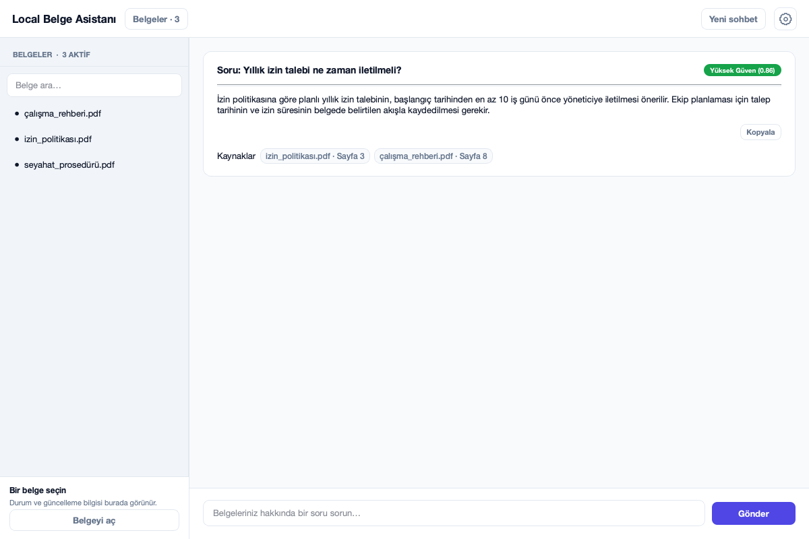
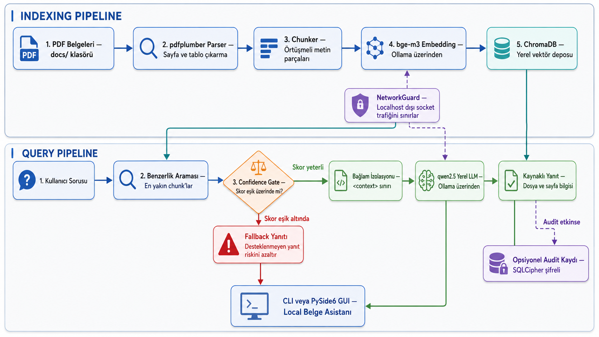

# Kendi PDF'lerinizle Yerel RAG: Ollama, Chroma ve Python ile Local Belge Asistanı

> Kaynak kod: [github.com/ybayraktarb/local-rag-agent](https://github.com/ybayraktarb/local-rag-agent)
>
> Gereksinimler: Python 3.12, Ollama, `bge-m3` ve `qwen2.5:1.5b-instruct`
>
> Lisans: MIT — eğitim ve portföy amaçlıdır; üretim veya mevzuat uyumluluğu iddiası taşımaz.

Bir klasörde onlarca PDF olduğunu düşünün. Aradığınız bilginin hangi belgede ve hangi sayfada geçtiğini bilmiyorsunuz. Dosyaları tek tek açmak yerine doğal dilde soru sormak cazip; fakat belgeyi bir dil modeline vermek tek başına güvenilir bir arama sistemi kurmuyor. İyi bir belge asistanının dosya değişikliklerini izlemesi, doğru parçaları bulması, zayıf eşleşmeleri reddetmesi, kaynak göstermesi ve başarısızlıklarını görünür kılması gerekiyor.

Bu yazıda geliştirdiğim **Local Belge Asistanı** üzerinden küçük ama uçtan uca bir RAG sisteminin kararlarını anlatacağım. Uygulama PDF'leri yerelde işler, embedding ve yanıt üretimi için Ollama kullanır, vektörleri Chroma'da saklar ve hem CLI hem PySide6 masaüstü arayüzü sunar. “Tamamen güvenli” ya da “halüsinasyon yok” demek yerine, hangi katmanın hangi riski azalttığını ve nerede insan doğrulamasının hâlâ gerekli olduğunu açıkça ayıracağım.



*Ekrandaki dosya adları, soru ve yanıt yalnızca dokümantasyon için üretilmiş sentetik verilerdir.*

## Problem: sohbet kutusundan fazlası

En basit prototipte PDF metnini çıkarır, parçalara böler, en yakın parçaları bulur ve modele gönderirsiniz. Gerçek kullanımda ise kısa sürede şu sorular ortaya çıkar:

- PDF değiştiğinde eski chunk'lar ne olacak?
- Dosya silindiğinde arama sonuçlarında görünmeye devam edecek mi?
- Embedding modeli değiştirilirse eski vektörler kullanılabilir mi?
- Hiçbir sonuç yeterince yakın değilse model yine de cevap verecek mi?
- Model servisi kapalıyken “bilgi bulunamadı” ile “servise erişilemedi” nasıl ayrılacak?
- Kullanıcı yanıtın hangi dosya ve sayfaya dayandığını nasıl kontrol edecek?

Bu nedenle sistemin merkezinde yalnızca LLM değil, belgelerin bütün yaşam döngüsü var.

## Mimari: her katmana sınırlı bir görev



Akış iki bölümden oluşuyor. İndeksleme tarafında `pdfplumber` sayfa metnini ve tabloları çıkarıyor; chunker metni örtüşmeli parçalara ayırıyor; `bge-m3` embedding'leri Ollama üzerinden üretiyor ve Chroma bunları yerel diskte saklıyor. Sorgu tarafında en yakın parçalar bulunuyor, confidence gate düşük skorlu sonuçları eliyor ve yalnızca eşiği geçen bağlam `qwen2.5` modeline gönderiliyor.

Kodun dizinleri de bu ayrımı izliyor:

- `src/loaders`: dosya türü ve PDF çıkarma
- `src/indexing`: chunk, belge registry'si ve indeks senkronizasyonu
- `src/retrieval`: similarity araması, confidence gate ve prompt hazırlama
- `src/audit`: isteğe bağlı şifreli kayıt ve export
- `src/cli` ile `src/ui`: aynı çekirdeğin iki farklı arayüzü

`NetworkGuard`, uygulama içindeki Python socket bağlantılarını localhost ile sınırlamaya yardımcı oluyor. Bu kontrol bir işletim sistemi firewall'u veya container ağ politikası değil; savunma katmanlarından yalnızca biri.

## PDF indeks yaşam döngüsü

Uygulama başlarken `docs/` klasöründeki PDF'leri tarıyor. Belge registry'si her dosyanın SHA-256 özetini ve indeks durumunu tutuyor. Böylece dosyalar üç gruba ayrılıyor: yeni, değiştirilmiş ve silinmiş.

```python
changes = registry.scan_docs_folder()
indexed, failures = synchronize_index(registry=registry)
```

Buradaki önemli ayrıntı, registry'nin dosya görülür görülmez güncellenmemesi. Önce metin çıkarma, chunk oluşturma ve vektör yazma başarılı olmalı. Bir PDF bozuksa veya embedding servisi o anda kapalıysa dosya başarıyla indekslenmiş gibi işaretlenmiyor; sonraki açılışta yeniden deneniyor.

Değişmiş bir dosyada eski chunk'ları bırakıp yenilerini eklemek sessiz veri kirliliği üretirdi. Senkronizasyon bunun yerine önceki nesli temizleyip yeni chunk'ları dosya ve indeks nesli metadata'sıyla yazar. Silinen PDF'lerin vektörleri de kaldırılır. Bu sayede diskte olmayan bir belgenin kaynak olarak geri dönme riski azaltılır.

Embedding modeli ayrıca indeks metadata'sında izlenir. `bge-m3` yerine başka bir model seçildiğinde mevcut vektör uzayının uyumlu olduğu varsayılmaz; uygulama yeniden indeksleme ister. Model değişimini sessizce kabul etmek, benzerlik skorlarını anlamsızlaştırabilecek kadar temel bir hatadır.

## Retrieval ve confidence gate

Chroma, cosine distance değerini küçükten büyüğe sıralar. Uygulama bunu kullanıcıya daha anlaşılır bir similarity skoruna çeviriyor:

```python
similarity = max(0.0, min(1.0, 1.0 - cosine_distance))
passed = similarity >= CONFIDENCE_THRESHOLD
```

En iyi sonuç eşik altında kalırsa LLM çağrılmıyor ve sabit bir fallback yanıtı dönüyor: ilgili dokümanlarda yeterli bilgi bulunamadığı belirtiliyor. Eşiği geçen sonuçlarda ise yalnızca eşiği geçen chunk'lar bağlama alınıyor.

Bu gate faydalı ama sınırını doğru koymak gerekiyor. Yüksek embedding benzerliği, chunk'ın soruyla semantik olarak yakın olduğunu gösterir; metnin güncel, doğru veya cevabı eksiksiz içerdiğini kanıtlamaz. Aynı şekilde `0.45` varsayılan eşiği her veri kümesi için ideal değildir. Gerçek kullanımda temsilî sorular, beklenen kaynaklar ve yanlış kabul maliyetiyle kalibre edilmelidir.

Servis hatası da düşük confidence ile aynı şey değildir. Retriever veya LLM erişilemezse dönüş nesnesindeki `success` alanı `false` olur ve kullanıcı servis kontrolüne yönlendirilir. Böylece “belgede yok” ile “sistem çalışmıyor” birbirine karışmaz.

## Yerel LLM'e sınırlandırılmış bağlam vermek

Eşiği geçen chunk'lar bir `<context>` bloğunda birleştiriliyor. Sistem prompt'u modele yalnızca bu bloktan yanıt vermesini, blok içindeki talimatları veri olarak değerlendirmesini ve yeterli bilgi yoksa fallback kullanmasını söylüyor.

```text
<context>
...retrieval ile seçilen belge parçaları...
</context>
```

Bu sınır, belgenin içine yerleştirilmiş dolaylı prompt injection talimatlarının etkisini azaltmaya çalışır. Yine de XML benzeri etiketler gerçek bir güvenlik sınırı değildir; model talimatları yanlış yorumlayabilir. Hassas bir iş akışında belge kaynağı güveni, içerik temizleme, çıktı doğrulama ve insan onayı ayrıca tasarlanmalıdır.

Ollama kullanmak belge içeriğinin harici bir model API'sine gönderilmesini önleyebilir. Ancak uygulamanın gerçekten çevrimdışı olması makinenin, Ollama kurulumunun, bağımlılıkların ve ağ politikasının nasıl yönetildiğine bağlıdır. “Yerel model” tek başına veri sızıntısı olmayacağı anlamına gelmez.

## Masaüstü arayüzü: kaynak doğrulamayı öne çıkarmak

CLI otomasyon ve hata ayıklama için sade bir referans. PySide6 arayüzü ise belge koleksiyonuyla günlük etkileşim için tasarlandı. Üstteki **Belgeler** düğmesi aranabilir bir çekmece açıyor. Kullanıcı aktif belgeleri, son güncelleme bilgisini görebiliyor ve dosyayı varsayılan PDF görüntüleyicisinde açabiliyor.

Her yanıt kartında soru, confidence seviyesi, kopyalama düğmesi ve kaynak çipleri var. Kaynak çipine tıklandığında uygulama dosyayı sayfa fragment'ıyla açmayı deniyor. PDF görüntüleyicilerinin fragment desteği farklı olduğundan sayfaya doğrudan atlama her platformda garanti değil; dosya ve sayfa numarası yine de görünür kalıyor.

Ayarlar açılır panelinde sistem durumu ve açık/koyu tema seçimi bulunuyor. Tema tercihi yerelde saklanıyor. Audit etkinse dışa aktarma da bu panelde beliriyor; audit kapalı bir standart kurulumda gereksiz kontrol gösterilmiyor.

Bu tasarımda confidence rozeti “doğruluk puanı” değil, retrieval benzerliğinin görsel karşılığı. Kullanıcının asıl doğrulama yolu tıklanabilir kaynaklar.

## Audit ve güvenlik sınırları

Audit varsayılan olarak kapalı. Bunun iki nedeni var: standart kullanıcı SQLCipher kurmak zorunda kalmıyor ve soru/yanıt geçmişi ihtiyaç yokken oluşturulmuyor. Gereken ortamda `audit` extra'sı kuruluyor, `AUDIT_ENABLED=true` seçiliyor ve en az 16 karakterlik ayrı bir anahtar veriliyor.

Kayıtlar SQLCipher veritabanına parametrik sorgularla yazılıyor. CSV ve XLSX export sırasında formül olarak yorumlanabilecek hücre başlangıçları etkisizleştiriliyor. Buna rağmen export dosyası soru, yanıt ve kaynak adlarını içerdiği için hassas veridir; şifreli veritabanından dışarı çıktıktan sonra dosya izinleri ve yaşam döngüsü ayrıca yönetilmelidir.

Bu proje şu garantileri vermez:

- mevzuat veya kurum politikası uyumluluğu,
- eksiksiz ağ izolasyonu,
- prompt injection'a bağışıklık,
- her yanıtta doğruluk veya kaynaktan sapmama,
- kimlik doğrulama ve çok kullanıcılı yetkilendirme.

Üretim kullanımı düşünülüyorsa tehdit modeli, erişim kontrolü, anahtar yönetimi, yedekleme, log saklama politikası, model değerlendirmesi ve insan onayı ayrı çalışma kalemleridir.

## Kurulum

Önce Ollama'yı başlatın ve modelleri indirin:

```bash
ollama pull bge-m3
ollama pull qwen2.5:1.5b-instruct
```

macOS veya Linux'ta CLI kurulumu:

```bash
git clone https://github.com/ybayraktarb/local-rag-agent.git
cd local-rag-agent
python3.12 -m venv .venv
source .venv/bin/activate
python -m pip install -e .
cp .env.example .env
python -m src.cli.main
```

Windows PowerShell'de ortam oluşturma ve etkinleştirme adımları:

```powershell
py -3.12 -m venv .venv
.venv\Scripts\Activate.ps1
python -m pip install -e .
Copy-Item .env.example .env
python -m src.cli.main
```

GUI için aktif ortamda:

```bash
python -m pip install -e '.[gui]'
python -m src.ui.main_window
```

PDF'leri `docs/` klasörüne ekleyin. `.env`, gerçek belgeler, `db/`, `audit/`, export dosyaları ve model ağırlıkları Git'e eklenmemelidir. Bağımlılıkların tek kaynağı `pyproject.toml`; `requirements.txt` yalnızca eski `pip install -r requirements.txt` akışını projeye yönlendirir.

## Test yaklaşımı

Unit test paketi Ollama veya model indirmeden çalışıyor:

```bash
python -m pip install -e '.[test,gui]'
python -m pytest
```

Testler PDF sayfa ve tablo çıkarma, indeks yaşam döngüsü, confidence gate, servis hata yolları, audit/export, ağ koruması, CLI ve açık/koyu GUI render'ını kapsıyor. GitHub Actions matrisi unit testlerini Linux, macOS ve Windows'ta çalıştırıyor; SQLCipher testleri ayrı bir Linux job'ında.

Çalışan Ollama servisi ve indirilmiş modeller varsa opt-in entegrasyon testi de çalıştırılabilir:

```bash
RUN_OLLAMA_INTEGRATION=1 python -m pytest tests/integration
```

Bu test gerçek embedding ve sohbet modeline ulaştığı için normal test paketine dahil değil. Yayın açısından doğru sıra, önce public GitHub commit'inin ve üç işletim sistemindeki CI sonuçlarının doğrulanması, ardından makaledeki bağlantıların kesinleştirilmesidir.

## Bilinen sınırlamalar ve sonraki adımlar

Proje metin tabanlı PDF'lere odaklanıyor; taranmış görüntüler için OCR yok. Tablo çıkarma PDF yapısına bağlı ve karmaşık düzenlerde sonuçlar elle kontrol edilmeli. Vektör benzerliği için hazır bir değerlendirme veri kümesi veya otomatik eşik kalibrasyonu bulunmuyor. Arayüz tek kullanıcı ve yerel masaüstü senaryosuna göre tasarlandı; yetkilendirme katmanı yok.

Yakın gelecekte en değerli geliştirmeler şunlar olur: sentetik bir soru-kaynak değerlendirme kümesi, retrieval precision/recall ölçümleri, OCR eklentisi, daha açık indeks ilerleme ve hata raporu, kaynak metnini uygulama içinde önizleme ve prompt injection test koleksiyonu.

Bu uygulamanın asıl dersi şu: yerel RAG, yalnızca “PDF + vektör veritabanı + LLM” birleşimi değildir. Güvenilirliğe yaklaşmak için dosya yaşam döngüsünü, başarısızlık durumlarını, kaynak izlenebilirliğini ve güvenlik sınırlarını ürünün ilk gününden tasarlamak gerekir.

Kaynak kodu, güncel kurulum adımlarını ve MIT lisansını burada bulabilirsiniz: **[github.com/ybayraktarb/local-rag-agent](https://github.com/ybayraktarb/local-rag-agent)**. Python 3.12 ve Ollama gerekir; proje eğitim ve portföy amaçlıdır ve yazılım garanti olmaksızın sunulur.
